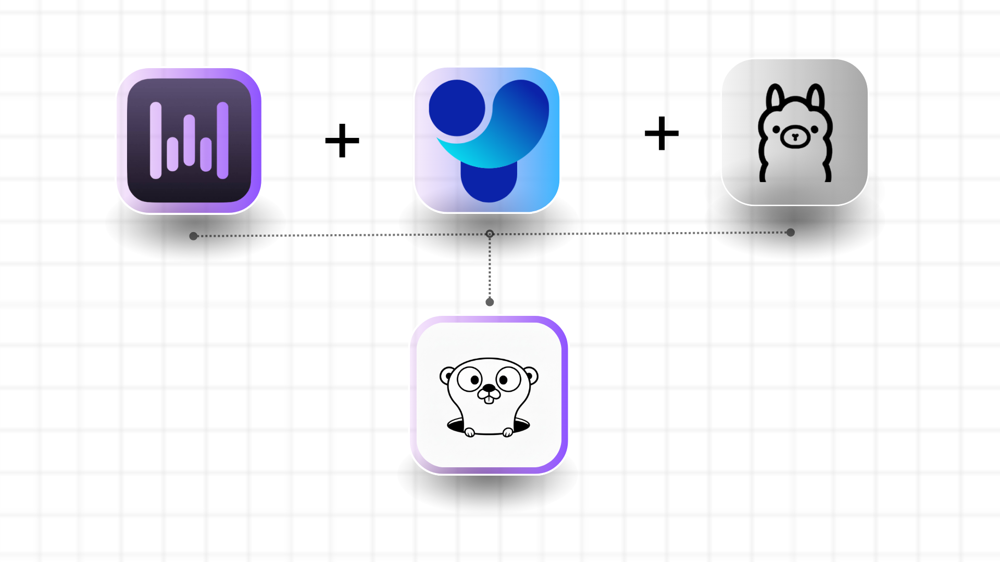

  

#  Duku VI Luna AI

**Luna AI** is a fully local multimodal robotic assistant built with computer vision, speech processing, and a local large language model.

> 100% offline. No cloud APIs. No external dependencies.

---

## 🚀 Features

- Multi-user face recognition
- Speech-to-text (Whisper.cpp)
- Text-to-speech (Piper)
- Local LLM (Ollama + Llama 3.2)
- Per-user conversation memory (SQLite)
- Rolling memory (last 5 messages per user)
- Natural name acquisition (randomized interaction threshold)
- Fully local execution

---

## 🏗 Architecture
